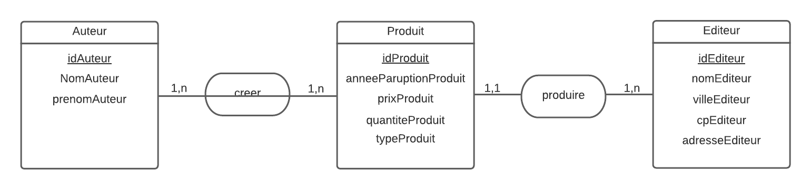
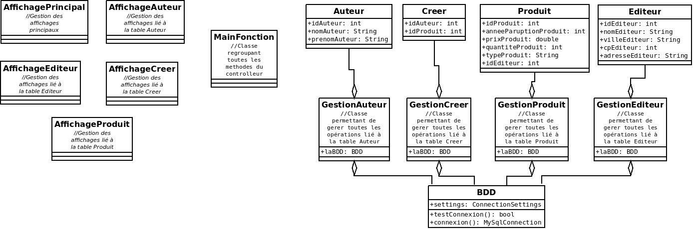

# <Your-Project-Title>

## Description

Logiciel permettant de gerer une base de donnée contenant les stocks de l'entreprise Furet du Nord. Il permet d'afficher, de modifier, de supprimer et d'ajouter des données dans chaque tables de la base de donnée. L'affichage se trouve dans le terminal.  

Ce logiciel a été réalisé dans le cadre d'un projet scolaire.

## SOMMAIRE

- [Installation](#installation)
- [Usage](#usage)
- [Fonctionnalités](#credits)
- [License](#license)

## Installation

Tout d'abord vous devez créer une base de donnée et un utilisateur qui aura les droits sur cette base de donnée, ensuite lancez le logiciel et entrez les identifiants de la base de donnée que vous venez de créer, choisissez l'option pour créer automatiquement les tables.  
Le logiciel est prêt à être utilisé

## A propos du projet
  
MCD de la base de donnée : 

Structure du programme:

Ce programme est réalisé en dart avec la méthode POO  

  
## Fonctionnalités

Ce logiciel permet de :
  Se connecter à une base de donnée  
  Créer les tables manquantes  
  Modifier les données de chaques tables en fonction d'un id  
  Ajouter des données dans chaques tables  
  Supprimé des données dans chaques tables en fonction d'un id  
  Afficher un produit en fonction de :  
  - l'id d'un produit
  - l'id d'un auteur
  - l'id d'un éditeur
  - nom d'un produit
  - nom d'un auteur
  - nom et prénom d'un auteur
  - nom d'un éditeur
  - un prix maximum
  - un prix minimum
  - un prix maximum et un prix minimum
  - une année de paruption maximum
  - une année de paruption minimum 
  - une année de paruption maximum et minimum 
  - un type  
  Trier l'affichage des produits en fonction de :  
  - prix croissant
  - prix décroissant
  - année croissante
  - année décroissante
  Afficher les données de la table Creer en fonction de :  
  - l'id d'un auteur
  - l'id d'un produit
  - nom d'un auteur
  - nom d'un produit  
  Affichage des auteurs en fonction de :  
  - l'id d'un auteur
  - l'id d'un produit
  - nom d'un auteur
  - nom et prénom d'un auteur
  - nom d'un produit  
  Affichage de éditeurs en fonction de :  
  - l'id d'un éditeur
  - l'id d'un produit
  - nom d'un éditeur
  - nom d'un produit

## Tests

Go the extra mile and write tests for your application. Then provide examples on how to run them here.
